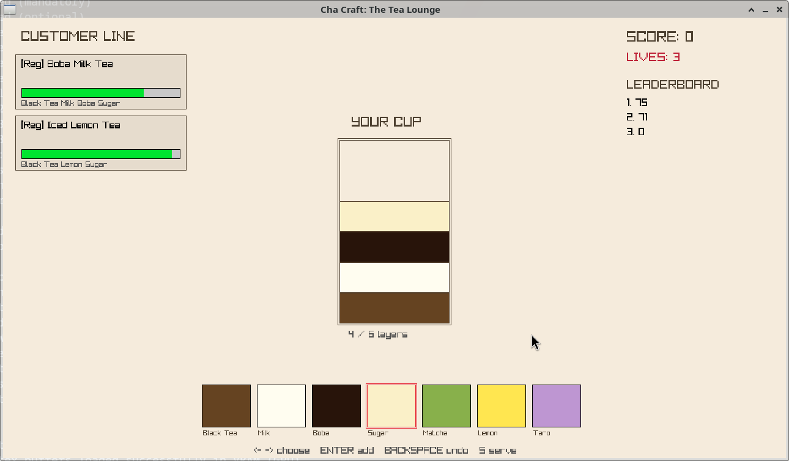

# Cha Craft: The Tea Lounge

> A cozy barista simulation built with **C++17** and **raylib** — also a
> practical tour of the STL containers.



## About

You run a tiny tea bar. Customers drift in with orders, you assemble their
drink from a carousel of ingredients, and you try to keep everyone happy
before their patience runs out. The longer a customer waits, the higher
they climb on the "who do I serve next" list — and VIPs cut the queue
with a base boost on top of that.

The project started life as a single 430-line `main.cpp` written for a
university DSA lab. This repository is the restructured version, split
into a proper C++ project layout so each STL container's role is obvious
from the directory tree.

## Gameplay & Controls

Customers appear on the left, the cup being built is in the middle, the
ingredient carousel is at the bottom, and score / lives / leaderboard
sit on the right.

| Key                  | Action                                 |
|----------------------|----------------------------------------|
| `←` / `→`            | Cycle through the ingredient carousel  |
| `Enter` / `Space`    | Push the selected ingredient into the cup |
| `Backspace`          | Undo the last ingredient (LIFO)        |
| `S`                  | Serve the most-urgent customer         |
| `R`                  | Restart after Game Over                |
| `Esc`                | Close the window                       |

A cup can hold up to **6** layers. The order matters in the visual
rendering but not for matching — the cup is compared as a multiset, so
shaking a Matcha Milk is fine as long as you used Matcha and Milk.

### Scoring

| Event                         | Score change            |
|-------------------------------|-------------------------|
| Match a Regular order          | `+50 + 2 * patience`    |
| Match a VIP order              | `+100 + 2 * patience`   |
| Wrong recipe                   | `-5`                    |
| Customer walks out (no lives)  | `-10` and `-1` life     |

You start with **3 lives**. Lose them all and you see the leaderboard
(top 5 of this session). Press `R` to start fresh.

## Downloads

Pre-built binaries for the latest release (v0.0.3-staticlink-test):

- [cha_craft-1.0.0-linux-x86_64.zip](https://github.com/harisahmed05/cha_craft/releases/download/v0.0.3-staticlink-test/cha_craft-1.0.0-linux-x86_64.zip)
- [cha_craft-1.0.0-macos-x86_64.zip](https://github.com/harisahmed05/cha_craft/releases/download/v0.0.3-staticlink-test/cha_craft-1.0.0-macos-x86_64.zip)
- [cha_craft-1.0.0-windows-x86_64.zip](https://github.com/harisahmed05/cha_craft/releases/download/v0.0.3-staticlink-test/cha_craft-1.0.0-windows-x86_64.zip)
- [SHA256SUMS.txt](https://github.com/harisahmed05/cha_craft/releases/download/v0.0.3-staticlink-test/SHA256SUMS.txt)

Verify integrity after downloading:

```bash
sha256sum -c SHA256SUMS.txt
```

All releases (including older versions) are listed at
[github.com/harisahmed05/cha_craft/releases](https://github.com/harisahmed05/cha_craft/releases).

## Install & Build

### Quick Start

If you already have a C++17 compiler, CMake 3.16+, and raylib, this is
the whole story:

```bash
git clone https://github.com/harisahmed05/cha_craft cha_craft
cd cha_craft
cmake -S . -B build
cmake --build build -j
./build/cha_craft
```

If you don't have raylib installed, pass `-DCHACRAFT_FETCH_RAYLIB=ON` to
the configure step (see [Building without a system raylib](#building-without-a-system-raylib)
below).

### Prerequisites

- A C++17-capable compiler (GCC 9+, Clang 10+, MSVC 2019+).
- [raylib](https://www.raylib.com/) (any 4.x or 5.x).
- CMake 3.16 or newer.

### Linux

```bash
# Debian / Ubuntu
sudo apt install build-essential cmake libraylib-dev

# Fedora
sudo dnf install gcc-c++ cmake raylib-devel

# Arch
sudo pacman -S --needed base-devel cmake raylib

# Configure + build
cmake -S . -B build
cmake --build build -j

# Run
./build/cha_craft
```

### macOS

```bash
brew install cmake raylib

cmake -S . -B build
cmake --build build -j
./build/cha_craft
```

### Windows (MSVC + vcpkg)

```powershell
git clone https://github.com/microsoft/vcpkg.git
cd vcpkg
.\bootstrap-vcpkg.bat
.\vcpkg install raylib:x64-windows

# Back in the project directory
cmake -S . -B build -DCMAKE_TOOLCHAIN_FILE=<path-to-vcpkg>/scripts/buildsystems/vcpkg.cmake
cmake --build build --config Release
.\build\Release\cha_craft.exe
```

### Building without a system raylib

If you don't have raylib installed and don't want to install it, pass
`-DCHACRAFT_FETCH_RAYLIB=ON` and CMake will download and build raylib
from source via `FetchContent`:

```bash
cmake -S . -B build -DCHACRAFT_FETCH_RAYLIB=ON
cmake --build build -j
```

> ⚠️ This downloads raylib from GitHub and compiles it on your machine,
> which takes a couple of minutes. Use a system package when you can.

## Project Layout

```
Cha_Craft/
├── CMakeLists.txt              # top-level build configuration
├── README.md                   # you are here
├── LICENSE                     # MIT
├── .gitignore
├── screenshot000.png           # in-game screenshot
├── cmake/
│   └── (raylib discovery is in CMakeLists.txt; this dir is reserved for future helpers)
├── include/
│   └── cha_craft/
│       ├── Constants.hpp       # every tunable number lives here
│       ├── Types.hpp           # CustomerType, Ingredient, GameState
│       ├── Customer.hpp        # Customer struct + priority comparator
│       ├── RecipeBook.hpp      # std::map<string, vector<string>>
│       ├── IngredientCarousel.hpp
│       ├── CupStack.hpp        # std::stack<string>
│       ├── CustomerLine.hpp    # std::vector<Customer> + priority_queue rebuild
│       ├── Input.hpp           # raylib-agnostic input vocabulary
│       ├── Renderer.hpp        # all raylib drawing calls
│       └── Game.hpp            # top-level game class
└── src/
    ├── main.cpp                # bootstrapping shim - calls Game::Run
    ├── Customer.cpp
    ├── CustomerLine.cpp
    ├── CupStack.cpp
    ├── Game.cpp
    ├── IngredientCarousel.cpp
    ├── Input.cpp
    ├── RecipeBook.cpp
    └── Renderer.cpp
```

## Architecture: why these STL containers?

Each container was chosen for a specific reason. The lessons here are
the same ones that show up in any data-structures class.

### `std::priority_queue<Customer>` — who gets served

We need to repeatedly answer "out of everyone in line, who is most
urgent right now?". A priority queue gives us `top()` in **O(1)** and
`push()`/`pop()` in **O(log n)**, which is exactly the access pattern
we want.

> **Caveat (and it's an important DSA lesson):** `std::priority_queue`
> does **not** support decrease-key. Patience ticks down every frame,
> so the heap's ordering would go stale. We work around this by keeping
> `std::vector<Customer>` as the *single source of truth* (patience
> lives there and updates every frame) and rebuilding a fresh
> `priority_queue` from the current state in **O(n log n)** on demand.
> For our small `n` (≤ 6 customers) this is trivially cheap and the
> ordering stays provably correct.

### `std::stack<std::string>` — the cup being built

A cup is built by adding ingredients one on top of another. "Undo" means
removing the most recently added ingredient. That is textbook **LIFO**
behaviour, and `std::stack` models it with **O(1)** push/pop/top.

### `std::map<std::string, std::vector<std::string>>` — the recipe book

`std::map` is a balanced red-black tree, so `find()` is **O(log n)**.
Recipes are looked up by name whenever we check what a customer's order
requires. The log-n lookup scales far better than a linear scan as the
recipe book grows.

### `std::vector<Ingredient>` — the ingredient carousel

The player cycles through a fixed, ordered set of ingredients with the
arrow keys. Contiguous storage plus **O(1)** random-access indexing is
the natural fit; a linked structure would waste time walking node-to-node
for something this simple.

## Contributing

Issues and pull requests are welcome. A few things that would be lovely:

- More recipes (and a config file to add them without recompiling).
- Sound effects — the `screenshot000.png` is silent for now.
- A difficulty curve instead of the static spawn interval.
- Unit tests for `CustomerLine::ServeHighestPriority` (it has clean
  inputs and is the most algorithmically interesting function).

When you open a PR, please run `cmake --build build -j` and make sure
nothing new warns under `-Wall -Wextra`.

## License

This project is released under the **MIT License** — see [LICENSE](LICENSE).
